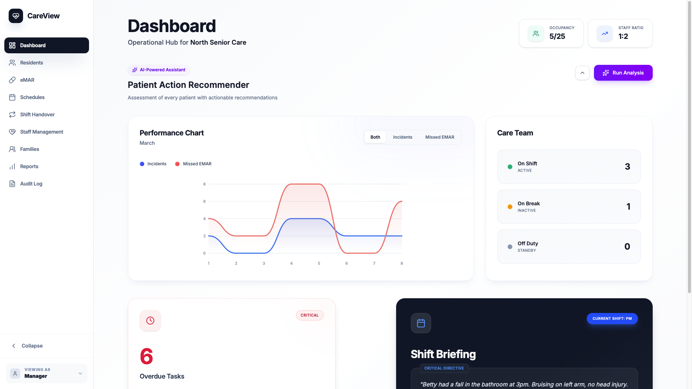
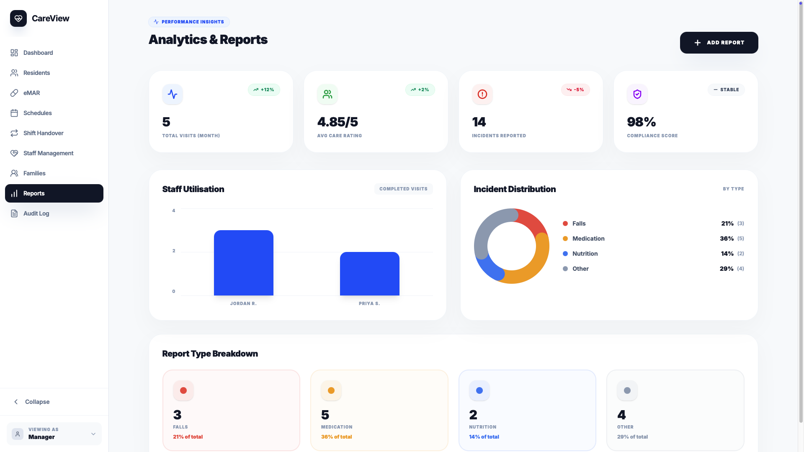
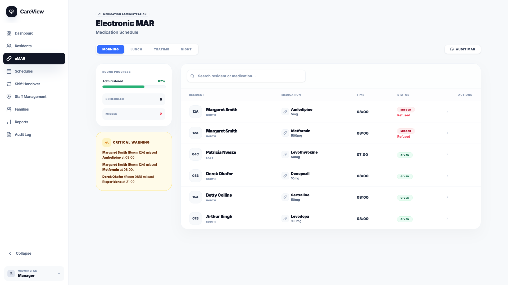

# CareView

An AI-assisted care home management system I built for North Senior Care during my internship, addressing the limitations of their existing system.

🔗 [Live Demo](https://careview-847694957064.europe-west2.run.app/)

---






---

## Features

- **AI Care Priority Engine** — a multi-step reasoning system that cross-references patient vitals, medication history, visit logs and incident reports to classify patients by urgency, with each action directly executable from the dashboard. Built with GPT-4o, few-shot prompting and a custom clinical reasoning framework to ensure accurate outputs.
- **Shift Handover Summariser** — categorises shift events into critical incidents and notable observations, assesses overall shift severity and generates a structured briefing for the next shift's care team.
- **Manager Dashboard** — real-time operational hub with custom performance charts, overdue task tracking, audit logs and AI-generated report and email drafting built into each action flow.
- **EMAR** — full medication administration record with scheduling, missed dose tracking and one-click reassignment.
- **Family Portal** — live activity feed giving families real-time visibility into visit logs, incident reports and upcoming care schedules, with full archive access.
- **Carer-Family Messaging** — in-app messaging between care staff and family members.

---

## Tech Stack

| Layer | Technology |
|-------|------------|
| Database | PostgreSQL — 10+ relational tables, Prisma ORM |
| Backend | Node.js / TypeScript — RESTful API with GPT-4o integration |
| Frontend | React / Next.js — role-based UI, custom charts, calendar view, Framer Motion, Tailwind CSS |
| Infrastructure | Docker / Google Cloud — containerised and deployed to GCP |

---

## Installation

Ensure you have the following installed before running locally:

- Node.js and npm
- PostgreSQL
- An IDE of your choice (VS Code recommended)

> **Note:** You will need your own PostgreSQL database and OpenAI API key. Add both to your `.env` file as shown below.

### Setup

1. Clone the repository
2. Create a `.env` file in the root:
```env
OPENAI_API_KEY="your-openai-key"
DATABASE_URL="your-database-url"
```
3. Install dependencies
```bash
npm install
```
4. Run migrations
```bash
npx prisma migrate dev
```
5. Seed the database
```bash
npx prisma db seed
```
6. Start the app
```bash
npm run dev
```

Visit `http://localhost:3000`
